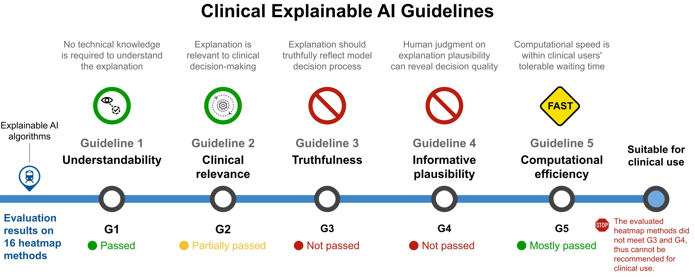

# Generating and Evaluating Post-Hoc Explanation from Deep Neural Networks for Multi-Modal Medical Image Analysis Tasks

This is the software repository for [our work](#cite) that evaluates 16 commonly-used explainable AI algorithms on a novel problem of multi-modal medical image analysis tasks. 

We generate explanations on two multi-modal medical image analysis tasks: brain glioma grading task on the [BraTS brain MRI dataset](https://www.med.upenn.edu/cbica/brats2020/data.html), and knee lesion classification on the [MRNet knee MRI dataset](https://stanfordmlgroup.github.io/competitions/mrnet/).
## Repository layout

```
├── code
│   ├── xai                 # The main code to generate and evaluate explanations using different post-hoc heatmap algorithms
│   ├── data_loader         # Dataloader for the BraTS data (data_loaders.py) and the synthetic glioma data (tumorgenerator_dataloader.py)
│   ├── model               # GeneNet is the VGG-like 3D model on the brain glioma MRI BraTS data 
│   ├── TumorSim            # Utility function for the tumorgenerator_dataloader.py of the synthetic glioma data. Code from http://dx.doi.org/10.1002/mp.14701
│   ├── MRNet               # Model training and testing for the MRNet dataset on knee lesion classification
│   ├── utils               # Utility function for model training
│   ├── sh                  # Bash and json files for experiment running
│   ├── xai_pipeline.py     # Heatmap explanation generation and evaluation pipeline for the BraTS model
│   └── xai_mrnet.py        # Heatmap explanation generation and evaluation pipeline for the MRNet model
├── paper                   # Preprint paper and supplementary materials
├── image                   # Graphic abstract of the associated papers
└── README.md
```


## Motivation

- Providing explanation is important for the clinical deployment of AI-based decision support systems
- We conduct computational evaluations to examine whether the existing post-hoc explainable AI algorithms can fulfill clinical requirements 
- Generating explanation for multi-modal medical image tasks

- Evaluating explainable AI algorithms based on clinical requirements as outlined in [the Clinical Explainable AI Guidelines](https://doi.org/10.1016/j.media.2022.102684)



<a name="installation"></a>
## Installation
```bash
git clone git@github.com:weinajin/multimodal_explanation.git
# install the requirements
conda create -n brain python=3.7
conda activate brain
conda install -c pytorch torchvison=0.5
pip install -r code/requirment.txt
```

<a name="usage"></a>
## Usage
### Model training on multi-modal medical image data

Training the model requires downloading the publicly-available [BraTS 2020 dataset](https://www.med.upenn.edu/cbica/brats2020/data.html) for the glioma grading task, or [MRNet dataset](https://stanfordmlgroup.github.io/competitions/mrnet/) for the knee lesion classification task.


1. Training model on the BraTS data
    ```bash
    python train.py --config sh/config_cc_plain2_BRATS_HGG.json --fold 1 --seed 2
    ```
2. Training model on the synthetic glioma data
    ```bash
    python train.py --config sh/tumorsyn_solar.json --seed 2
    ```
3. Training model on the knee MRI data
    ```bash
    python train.py --task meniscus  --seed 2
    ```

### Generating and evaluating heatmap explanations

Generating and evaluating the heatmaps require to have the trainde model. In addition, the informative plausibility evaluation will need the [BraTS 2020 dataset](https://www.med.upenn.edu/cbica/brats2020/data.html) dataset, which contains the ground-truth tumor segmentation mask. 

The ```--job``` parameter can be spcified to run for different jobs listed below:


- ```gethm```: Generate heatmap explanation for the explainable AI algorithm as specified in the json file: ```xai/method_list```. The generated heatmaps are saved as .pkl files for further evaluation. 
- ```mi```: Run modality ablation experiments to get the modality Shapley value as modality importance
- ```mi_reporting```: Compute the Shapley value for each medical image modality as modality importance
- ```mi_readhm```: Calculate the heatmap sum for each image modality
- ```fp_iou```: Calculate the feature portion (fp) and intersection over union (iou) by comparing the heatmap with ground-truth feature segmentation masks
- ```msfi_readhm```: Calculate the feature portion for each image modality for the MSFI metric
- ```acc_drop```: Run the cumulative feature removal experiment
- ```pipeline```: Run the above functions as a pipeline to generate and evaluate heatmaps
- ```pipeline_nogethm```: Run the above heatmap evaluation pipeline without generating heatmaps
- ```mi_corr```: Calculate the modality importance correlation

Example:
```bash
python xai_pipeline.py --config sh/xai_cc_plain2_BRATS_HGG.json --fold 1 --seed $SEED --bs 1 --job <job>
```


<a name="cite"></a>
## Cite

[Guidelines and evaluation of clinical explainable AI in medical image analysis](https://doi.org/10.1016/j.media.2022.102684) 

Weina Jin, Xiaoxiao Li, Mostafa Fatehi, Ghassan Hamarneh.
Medical Image Analysis. 2022
```bibtext
@article{JIN2022102684,
title = {Guidelines and evaluation of clinical explainable AI in medical image analysis},
author = {Weina Jin and Xiaoxiao Li and Mostafa Fatehi and Ghassan Hamarneh},
journal = {Medical Image Analysis},
pages = {102684},
year = {2022},
issn = {1361-8415},
doi = {https://doi.org/10.1016/j.media.2022.102684},
url = {https://www.sciencedirect.com/science/article/pii/S1361841522003127},
}
```

[Evaluating Explainable AI on a Multi-Modal Medical Imaging Task: Can Existing Algorithms Fulfill Clinical Requirements?](https://ojs.aaai.org/index.php/AAAI/article/view/21452)

Weina Jin, Xiaoxiao Li, Ghassan Hamarneh.
AAAI. 2022
```bibtext
@article{Jin_Li_Hamarneh_2022, 
title = {Evaluating Explainable AI on a Multi-Modal Medical Imaging Task: Can Existing Algorithms Fulfill Clinical Requirements?}, 
author = {Jin, Weina and Li, Xiaoxiao and Hamarneh, Ghassan}, 
journal = {Proceedings of the AAAI Conference on Artificial Intelligence}, 
url = {https://ojs.aaai.org/index.php/AAAI/article/view/21452}, 
DOI = {10.1609/aaai.v36i11.21452}, 
year = {2022}, month = {Jun.}, number = {11}, volume = {36}, 
pages = {11945-11953} 
}
```

<a name="faq"></a>
## Questions?
Please create a [new issue](https://github.com/weinajin/multimodal_explanation/issues/new/choose) detailing concisely, yet complete what issue you encountered, in a reproducible way.


